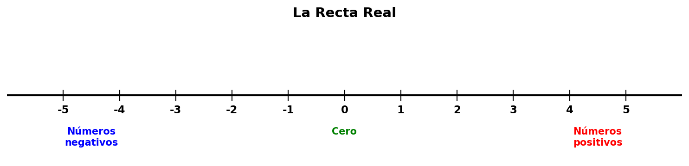
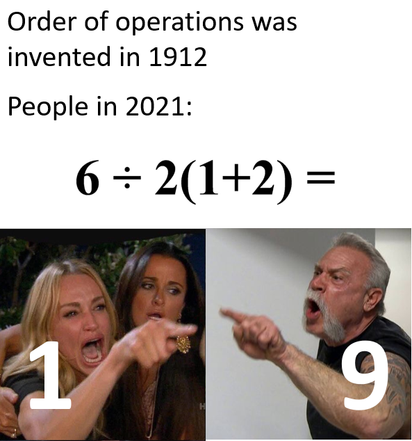

# La Recta Real y los Números Reales

## Repaso de los números reales

Los **números reales** son todos los números que existen: los naturales (1, 2, 3…), los enteros (…, -2, -1, 0, 1, 2…), los racionales (fracciones como ½, decimales como 3.14) y los irracionales (como √2 o π). Básicamente, cualquier número que puedas imaginar en una recta.

### Números positivos y negativos

Los **números positivos** (+)
: Son todos los números mayores que cero: 1, 2, 3, ½, π, √2… Se escriben con signo + o sin ningún signo. En la recta real están a la **derecha del cero**. Se usan para contar, medir temperaturas sobre cero, ganancias, altitudes sobre el nivel del mar, etc.

Los **números negativos** (−)
: Son todos los números menores que cero: −1, −2, −3, −½… En la recta real están a la **izquierda del cero**. Se usan para temperaturas bajo cero, deudas, altitudes por debajo del nivel del mar, etc.

El **cero** (0) no es positivo ni negativo — es el punto neutral. Separa los positivos de los negativos en la recta.

Ejemplos cotidianos:
- +12 °C (hace calor) vs. −5 °C (hace frío)
- Tener +500 lempiras (dinero a tu favor) vs. −500 lempiras (le debes al banco)
- +3 pisos (arriba de la planta baja) vs. −2 pisos (sótano)

---

## 1. Representación en la Recta Real

La **recta real** es una línea recta donde cada punto representa un número. Nos sirve para visualizar y ordenar los números.

### Características

- Tiene **dos direcciones**: a la derecha del 0 van los números **positivos**, a la izquierda los **negativos**.
- Es **infinita**: se extiende sin fin en ambas direcciones (por eso las flechas en los extremos).
- Es **continua**: no hay "huecos" entre un número y otro. Entre dos números reales siempre hay infinitos números más.
- Cada número real tiene **una única posición** en la recta.

### Propiedades importantes

| Propiedad | Explicación |
|-----------|-------------|
| **Orden total** | Dos números reales siempre se pueden comparar: uno es menor, igual o mayor que el otro. |
| **Densidad** | Entre dos números reales distintos siempre hay otro número real. Por ejemplo, entre 1.5 y 1.6 está 1.55, y entre 1.55 y 1.6 está 1.575… ¡y así hasta el infinito! |
| **Completitud** | La recta real no tiene "saltos". A diferencia de los números racionales, los números reales llenan toda la recta sin dejar espacios. |

---

## 2. Propiedades de la Igualdad

Cuando decimos que dos números son iguales (a = b), se cumplen estas propiedades:

### Propiedades de la igualdad

| Propiedad | Significado | Ejemplo |
|-----------|-------------|---------|
| **Reflexiva** | Todo número es igual a sí mismo | 5 = 5 |
| **Simétrica** | Si a = b, entonces b = a | Si x = 3, entonces 3 = x |
| **Transitiva** | Si a = b y b = c, entonces a = c | Si x = y y y = 5, entonces x = 5 |

---

## 3. Relación de Orden en los Números Reales

Los números reales tienen un orden natural. Decimos que **a es menor que b** (a < b) si a está a la izquierda de b en la recta real.

### Propiedades de la relación de orden

| Propiedad | Significado | Ejemplo |
|-----------|-------------|---------|
| **Tricotomía** | Dados dos números a y b, solo una es cierta: a < b, a = b, o a > b | -3 < 2, 4 = 4, 7 > 0 |
| **Transitiva** | Si a < b y b < c, entonces a < c | Si 2 < 5 y 5 < 10, entonces 2 < 10 |
| **Antisimétrica** | Si a ≤ b y b ≤ a, entonces a = b | — |
| **Aditiva** | Si a < b, entonces a + c < b + c | Si 3 < 7, entonces 3 + 2 < 7 + 2 |

---

## 4. Operaciones Algebraicas con Números Reales

Los números reales se pueden **sumar, restar, multiplicar y dividir** (excepto por cero). Estas operaciones siguen reglas bien definidas.

### Suma y resta

| Regla | Ejemplo |
|-------|---------|
| Signos iguales → se suman y se conserva el signo | 5 + 3 = 8,  (-5) + (-3) = -8 |
| Signos diferentes → se restan y se pone el signo del mayor | 5 + (-3) = 2,  (-5) + 3 = -2 |
| Restar un número es lo mismo que sumar su inverso aditivo | 5 – 3 = 5 + (-3) |

### Multiplicación y división

| Regla | Ejemplo |
|-------|---------|
| Signos iguales → resultado positivo | 5 × 3 = 15,  (-5) × (-3) = 15 |
| Signos diferentes → resultado negativo | 5 × (-3) = -15,  (-5) × 3 = -15 |
| Dividir entre cero **no está definido** | 5 ÷ 0 no existe |

### Inverso Aditivo

El **inverso aditivo** de un número a es el número que, **sumado con a, da cero**. Es simplemente **cambiarle el signo** al número.

- El inverso aditivo de **5** es **-5**, porque 5 + (-5) = 0.
- El inverso aditivo de **-8** es **8**, porque (-8) + 8 = 0.
- El inverso aditivo de **0** es **0**, porque 0 + 0 = 0.
- El inverso aditivo de **√2** es **-√2**, porque √2 + (-√2) = 0.
- El inverso aditivo de **-¾** es **¾**, porque -¾ + ¾ = 0.

| Número | Inverso Aditivo | Suma |
|--------|-----------------|------|
| 7 | -7 | 7 + (-7) = 0 |
| -4 | 4 | (-4) + 4 = 0 |
| ½ | -½ | ½ + (-½) = 0 |

También se le llama **opuesto** de un número. Sirve para **restar**: restar un número es sumar su inverso aditivo.

> **Fórmula:**  a – b = a + (**inverso aditivo de b**)

---

### Recíproco de un número

El **recíproco** (o **inverso multiplicativo**) de un número a (distinto de cero) es el número que, **multiplicado por a, da 1**. Se obtiene **invirtiendo la fracción**:

- El recíproco de **5** es **⅕** (un quinto), porque 5 × ⅕ = 1.
- El recíproco de **-3** es **-⅓**, porque (-3) × (-⅓) = 1.
- El recíproco de **½** es **2**, porque ½ × 2 = 1.
- El recíproco de **-¾** es **-⁴⁄₃**, porque (-¾) × (-⁴⁄₃) = 1.
- El recíproco de **√2** es **1/√2**, porque √2 × 1/√2 = 1.

| Número | Recíproco | Multiplicación |
|--------|-----------|----------------|
| 7 | 1/7 | 7 × 1/7 = 1 |
| -4 | -1/4 | (-4) × (-1/4) = 1 |
| 2/3 | 3/2 | (2/3) × (3/2) = 1 |
| 0.5 | 2 | 0.5 × 2 = 1 |

> ⚠️ **El cero no tiene recíproco** porque no existe ningún número que multiplicado por 0 dé 1.

El recíproco sirve para **dividir**: dividir entre un número es lo mismo que multiplicar por su recíproco.

> **Fórmula:**  a ÷ b = a × (**recíproco de b**),  con b ≠ 0

### Comparación rápida

| Concepto | Operación | Resultado | Ejemplo |
|----------|-----------|-----------|---------|
| Inverso aditivo | Suma | Da **0** | 5 + (-5) = 0 |
| Recíproco | Multiplicación | Da **1** | 5 × ⅕ = 1 |

---

## 5. Valor Absoluto

El **valor absoluto** de un número es su distancia del cero en la recta real. Como las distancias siempre son positivas (no puedes estar a −5 metros de algo), el valor absoluto **siempre es un número no negativo**.

> **Definición (nivel secundaria/preparatoria):** El valor absoluto de un número *a*, escrito |*a*|, es:
>
> - Si *a* es **positivo** o **cero**, entonces |*a*| = *a*
> - Si *a* es **negativo**, entonces |*a*| = −*a* (es decir, le quitamos el signo)

**Ejemplos:**

- |5| = 5 porque 5 ya es positivo
- |−5| = 5 porque −5 es negativo, y al quitarle el signo queda 5
- |0| = 0
- |−12| = 12
- |+7| = 7

**Interpretación geométrica:** |*a*| es la distancia entre el punto *a* y el punto 0 en la recta real. Así, |3| = 3 porque el 3 está a 3 unidades del cero, y |−3| = 3 porque el −3 también está a 3 unidades del cero (pero del lado izquierdo).

**Propiedades importantes:**
* Positividad: $|a| \geq 0$
* Si $a<b$, entonces $|b - a| = b-a$
* Si $a>b$, entonces $|b - a| = a - b$

---

## 6. Distributividad

La **multiplicación es distributiva respecto a la suma** (y la resta). Esto significa que puedes "expandir" o "factorizar" expresiones con paréntesis.

> **Fórmula:**  a × (b + c) = a × b + a × c

**Ejemplos:**

- 3 × (4 + 5) = 3 × 4 + 3 × 5 = 12 + 15 = 27
- 2 × (7 − 3) = 2 × 7 − 2 × 3 = 14 − 6 = 8
- (6 + 2) × 5 = 6 × 5 + 2 × 5 = 30 + 10 = 40

La distributividad funciona en **ambos sentidos**:

- **Expandir:** a(b + c) → ab + ac
- **Factorizar:** ab + ac → a(b + c)

Factorizar es útil para simplificar fracciones:

$$\frac{6}{9} = \frac{2 \times 3}{3 \times 3} = \frac{2}{3}$$

### Casos importantes

| Expresión | Expandida | Simplificada |
|-----------|-----------|-------------|
| (a + b)(c + d) | ac + ad + bc + bd | — |
| (a + b)² | a² + 2ab + b² | — |
| (a − b)² | a² − 2ab + b² | — |

---

## 7. Cambio de signo (multiplicar por un número negativo)

Multiplicar un número por **−1** invierte su signo:

> **Fórmula:**  (−1) × a = −a

Multiplicar por **−1** es equivalente al **inverso aditivo**: cambiarle el signo.

**Ejemplos:**

- (−1) × 7 = −7
- (−1) × (−5) = 5
- −(a − b) = −a + b (aplicando distributividad)

### Regla práctica

| Multiplicar por | Efecto | Ejemplo |
|-----------------|--------|---------|
| **+1** | No cambia nada | 5 × 1 = 5 |
| **−1** | Invierte el signo | 5 × (−1) = −5 |
| **+2** | Duplica, mismo signo | 5 × 2 = 10 |
| **−2** | Duplica, signo invertido | 5 × (−2) = −10 |

### Importante: resolver paréntesis primero

Cuando hay un signo negativo **delante** de un paréntesis, hay que aplicarle la distributividad:

- −(a + b) = −a − b
- −(a − b) = −a + b
- −(−a) = a

**Ejemplo:**

$$-(3 + 5 - 2) = -3 - 5 + 2 = -6$$

---

## 8. Orden de operaciones (PEMDAS)

Cuando una expresión tiene varias operaciones, hay que seguir un **orden** para obtener el resultado correcto. Se conoce como **PEMDAS** (o "PEMDAS" en español):

| Letra | Significado | Operaciones |
|-------|-------------|------------|
| **P** | Paréntesis | Primero: resolver todo lo que esté dentro de paréntesis, corchetes o llaves |
| **E** | Exponentes | Segundo: potencias y raíces |
| **M** | Multiplicación | Tercero: multiplicaciones de izquierda a derecha |
| **D** | División | Tercero: divisiones de izquierda a derecha |
| **A** | Adición (Suma) | Cuarto: sumas de izquierda a derecha |
| **S** | Sustracción (Resta) | Quinto: restas de izquierda a derecha |

> ⚠️ **Importante:** La M y la D están al mismo nivel — se hacen de **izquierda a derecha**, lo mismo para la A y la S.

**Ejemplo paso a paso:**

$$3 + 2 \times (4 - 1)^2$$

1. **P** (paréntesis): 4 − 1 = 3  →  3 + 2 × **3**²
2. **E** (exponentes): 3² = 9  →  3 + 2 × **9**
3. **M** (multiplicación): 2 × 9 = 18  →  3 + **18**
4. **A** (suma): 3 + 18 = **21**

### Errores comunes

| Expresión | Error (PEMDAS mal aplicado) | Correcto |
|-----------|---------------------------|---------|
| 8 ÷ 4 × 2 | Hacer la multiplicación primero: 8 ÷ (4 × 2) = 1 | De izquierda a derecha: (8 ÷ 4) × 2 = 4 |
| 2 + 3 × 4 | Sumar primero: (2 + 3) × 4 = 20 | Multiplicar primero: 2 + (3 × 4) = 14 |

### El meme clásico

Y precisamente por esto los memes de PEMDAS se vuelven virales... 😄

*¿Te suena familiar? Probablemente alguien falló en recordar que la M viene antes que la A.*

---

## 9. Propiedades de las Potencias (exponentes enteros)

Una **potencia** es una forma abreviada de escribir un producto repetido: $a^n$ significa "$a$ multiplicado por sí mismo $n$ veces".

> **Base:** el número que se repite
> **Exponente:** cuántas veces se repite

$$a^n = \underbrace{a \times a \times \cdots \times a}_{n \text{ veces}}$$

### Propiedades fundamentales

| Propiedad | Fórmula | Ejemplo |
|-----------|---------|---------|
| **Producto de potencias (misma base)** | $a^m \times a^n = a^{m+n}$ | $3^2 \times 3^4 = 3^{2+4} = 3^6$ |
| **Cociente de potencias (misma base)** | $a^m \div a^n = a^{m-n}$ | $5^4 \div 5^2 = 5^{4-2} = 5^2$ |
| **Potencia de una potencia** | $(a^m)^n = a^{m \times n}$ | $(2^3)^2 = 2^{3 \times 2} = 2^6$ |
| **Potencia de un producto** | $(a \times b)^n = a^n \times b^n$ | $(3 \times 4)^2 = 3^2 \times 4^2$ |
| **Potencia de un cociente** | $(a \div b)^n = a^n \div b^n$ | $(6 \div 2)^2 = 6^2 \div 2^2$ |

### Casos especiales

| Caso | Regla | Ejemplo |
|------|-------|---------|
| $a^0$ | $= 1$ (para $a \neq 0$) | $5^0 = 1$ |
| $a^1$ | $= a$ | $7^1 = 7$ |
| $a^{-n}$ | $= 1 / a^n$ | $2^{-3} = 1 / 2^3 = 1/8$ |
| $1^n$ | $= 1$ | $1^{100} = 1$ |
| $(-a)^n$ (n par) | $= a^n$ | $(-3)^4 = 3^4 = 81$ |
| $(-a)^n$ (n impar) | $= -a^n$ | $(-3)^3 = -3^3 = -27$ |

### Errores comunes

| Error | Corrección |
|-------|-----------|
| $a^m \times a^n = a^{m \times n}$ | ❌ | Correcto: $a^{m+n}$ |
| $(a + b)^n = a^n + b^n$ | ❌ | La potencia **no** se distribuye sobre la suma |
| $a^m \div a^n = a^{m \div n}$ | ❌ | Correcto: $a^{m-n}$ |
| $a^{-n} = -a^n$ | ❌ | El signo negativo del exponente indica **recíproco**, no número negativo |

---

## 10. La raíz n-ésima de un número real

Hasta ahora hemos hablado de **elevar un número a una potencia** (por ejemplo, 3² = 9). La **raíz n-ésima** es la operación inversa: cuando conocemos el resultado y la potencia, buscamos la base.

### Definición

Si $a^n = b$, entonces $a$ es una **raíz n-ésima** de $b$. Se escribe así:

$$a = \sqrt[n]{b}$$

donde:
- $n$ es el **índice** de la raíz (indica qué tipo de raíz)
- $b$ es el **radicando** (el número dentro de la raíz)
- el símbolo $\sqrt{}$ es el **símbolo de raíz**

### Ejemplos básicos

| Operación | Se lee | Significado |
|-----------|--------|-------------|
| $\sqrt{9}$ | raíz cuadrada de 9 | "¿Qué número al cuadrado da 9?" → 3 |
| $\sqrt[3]{8}$ | raíz cúbica de 8 | "¿Qué número al cubo da 8?" → 2 |
| $\sqrt[4]{16}$ | raíz cuarta de 16 | "¿Qué número elevado a la 4ta da 16?" → 2 |

### La raíz cuadrada especial

La **raíz cuadrada** ($n = 2$) es la más común. Cuando ves $\sqrt{9}$, sin índice, siempre se entiende que es raíz cuadrada:

$$\sqrt{9} = 3 \quad \text{porque} \quad 3^2 = 9$$

> ⚠️ **¡Atención!** El número −3 también cumple (−3)² = 9. Sin embargo, por convención, **la raíz cuadrada se define como el valor positivo**. Por eso $\sqrt{9} = 3$ (no −3). En cambio, la raíz cúbica SÍ puede ser negativa: $\sqrt[3]{-8} = -2$ porque $(−2)^3 = -8$.

### Raíces de números especiales

| Raíz | Resultado | Verificación |
|------|----------|---------------|
| $\sqrt{1}$ | 1 | 1² = 1 |
| $\sqrt{0}$ | 0 | 0² = 0 |
| $\sqrt{144}$ | 12 | 12² = 144 |
| $\sqrt{2}$ | ≈ 1.4142... | es un número **irracional** |
| $\sqrt[3]{-27}$ | −3 | (−3)³ = −27 |
| $\sqrt[4]{81}$ | 3 | 3⁴ = 81 |

### Propiedades de las raíces

| Propiedad | Fórmula | Ejemplo |
|-----------|---------|---------|
| **Producto de raíces del mismo índice** | $\sqrt[n]{a} \times \sqrt[n]{b} = \sqrt[n]{a \times b}$ | $\sqrt{2} \times \sqrt{8} = \sqrt{16} = 4$ |
| **Cociente de raíces del mismo índice** | $\dfrac{\sqrt[n]{a}}{\sqrt[n]{b}} = \sqrt[n]{\dfrac{a}{b}}$ | $\sqrt{12} / \sqrt{3} = \sqrt{4} = 2$ |
| **Raíz de una raíz** | $\sqrt[m]{\sqrt[n]{a}} = \sqrt[m \times n]{a}$ | $\sqrt{\sqrt{16}} = \sqrt[4]{16} = 2$ |
| **Raíz de una potencia** | $\sqrt[n]{a^n} = a$ (si $a \geq 0$) | $\sqrt{5^2} = 5$ |

### Conexión con las potencias

Las raíces y las potencias son operaciones **inversas**. Esta conexión es muy útil para simplificar expresiones:

| Raíz | Como potencia | Resultado |
|------|--------------|-----------|
| $\sqrt{a}$ | $a^{1/2}$ | $\sqrt{a}$ |
| $\sqrt[3]{a}$ | $a^{1/3}$ | raíz cúbica |
| $\sqrt[n]{a}$ | $a^{1/n}$ | raíz n-ésima |

> 💡 **Regla fácil:** la raíz n-ésima de $a$ es lo mismo que elevar $a$ a la potencia $1/n$.

---

## 11. La definición 1/n (el recíproco del exponente)

Recordemos que el **recíproco** (o inverso) de un número es cuando le das vuelta. El recíproco de 2 es $\dfrac{1}{2}$, el de $\dfrac{3}{4}$ es $\dfrac{4}{3}$.

Con los exponentes pasa algo similar, pero el **recíproco del exponente** (es decir, $\frac{1}{n}$) nos da **raíces**.

### La idea central

> Si $a^n = b$, entonces $a = b^{1/n}$.

El exponente $\dfrac{1}{n}$ significa: "buscar la raíz n-ésima".

### Ejemplos concretos

| Exponente | Significado | Ejemplo | Resultado |
|-----------|-------------|---------|-----------|
| $a^{1/2}$ | Buscar la raíz cuadrada | $36^{1/2}$ | $\sqrt{36} = 6$ |
| $a^{1/3}$ | Buscar la raíz cúbica | $8^{1/3}$ | $\sqrt[3]{8} = 2$ |
| $a^{1/4}$ | Buscar la raíz cuarta | $16^{1/4}$ | $\sqrt[4]{16} = 2$ |
| $a^{1/5}$ | Buscar la raíz quinta | $32^{1/5}$ | $\sqrt[5]{32} = 2$ |

### Ejemplo paso a paso

**¿Cuánto es $64^{1/3}$?**

1. $64^{1/3}$ significa "la raíz cúbica de 64"
2. Nos preguntamos: ¿qué número elevado al cubo da 64?
3. $4 \times 4 \times 4 = 64$
4. Entonces $64^{1/3} = 4$

### La lógica del 1/n en una tabla

| Si $a^{1/n}$ elevado a la $n$... | Resultado | Explicación |
|----------------------------------|----------|-------------|
| $(a^{1/n})^n$ | $a^{1/n \times n} = a^1 = a$ | Por la propiedad de potencias |
| Entonces $a^{1/n}$ es la **raíz n-ésima** de $a$ | $\sqrt[n]{a}$ | Definición |

> 💡 **Para recordar:** cuando el exponente es una fracción $\dfrac{1}{n}$, el **denominador** te dice qué raíz buscar. El **numerador** 1 te dice que estás buscando la "primera" raíz (la normal).

---

## 12. Potencias racionales (exponentes fraccionarios)

Ya sabes que $a^{1/n}$ es la raíz n-ésima de $a$. ¿Qué pasa cuando el exponente es una fracción más general, como $\dfrac{m}{n}$?

### Definición

Una **potencia racional** es aquella donde el exponente es una fracción de números enteros: $\dfrac{m}{n}$. Se define así:

$$a^{m/n} = \sqrt[n]{a^m} = (\sqrt[n]{a})^m$$

Es decir: primero elevas a la $m$, luego sacas la raíz $n$-ésima, o al revés — el resultado es el mismo.

### Ejemplos

| Expresión | Interpretación | Desarrollo | Resultado |
|-----------|---------------|------------|-----------|
| $8^{2/3}$ | "(raíz cúbica de 8) al cuadrado" | $\sqrt[3]{8} = 2$, luego $2^2 = 4$ | 4 |
| $16^{3/4}$ | "(raíz cuarta de 16) al cubo" | $\sqrt[4]{16} = 2$, luego $2^3 = 8$ | 8 |
| $9^{3/2}$ | "(raíz cuadrada de 9) al cubo" | $\sqrt{9} = 3$, luego $3^3 = 27$ | 27 |
| $4^{5/2}$ | "(raíz cuadrada de 4) a la 5ta" | $\sqrt{4} = 2$, luego $2^5 = 32$ | 32 |

### Paso a paso con $8^{2/3}$

1. **Identifica el numerador y el denominador:** $m = 2$, $n = 3$
2. **El denominador $n$ dice qué raíz:** raíz cúbica ($\sqrt[3]{}$)
3. **El numerador $m$ dice qué potencia:** elevar a la 2
4. **Aplica:** $8^{2/3} = (\sqrt[3]{8})^2 = (2)^2 = 4$
5. **Verifica:** si $(8^{2/3})^3 = 8^2 = 64$, entonces $8^{2/3} = \sqrt[3]{64} = 4$ ✅

### Propiedades que siguen vigentes

Todas las propiedades de las potencias que ya conocías funcionan también con exponentes racionales:

| Propiedad | Fórmula | Ejemplo |
|-----------|---------|---------|
| **Producto** | $a^{m/n} \times a^{p/q} = a^{m/n + p/q}$ | $4^{1/2} \times 4^{1/2} = 4^{1} = 4$ |
| **Potencia de potencia** | $(a^{m/n})^{p/q} = a^{m/n \times p/q}$ | $(9^{1/2})^3 = 9^{3/2} = 27$ |
| **Cociente** | $a^{m/n} / a^{p/q} = a^{m/n - p/q}$ | $8^{2/3} / 8^{1/3} = 8^{1/3} = 2$ |

