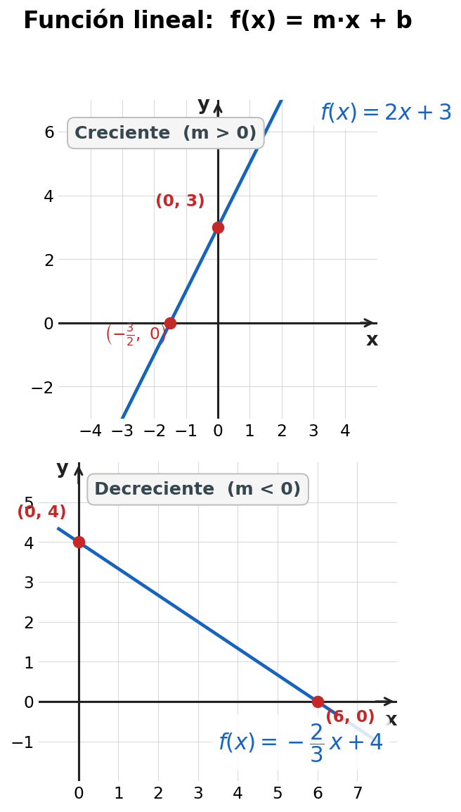
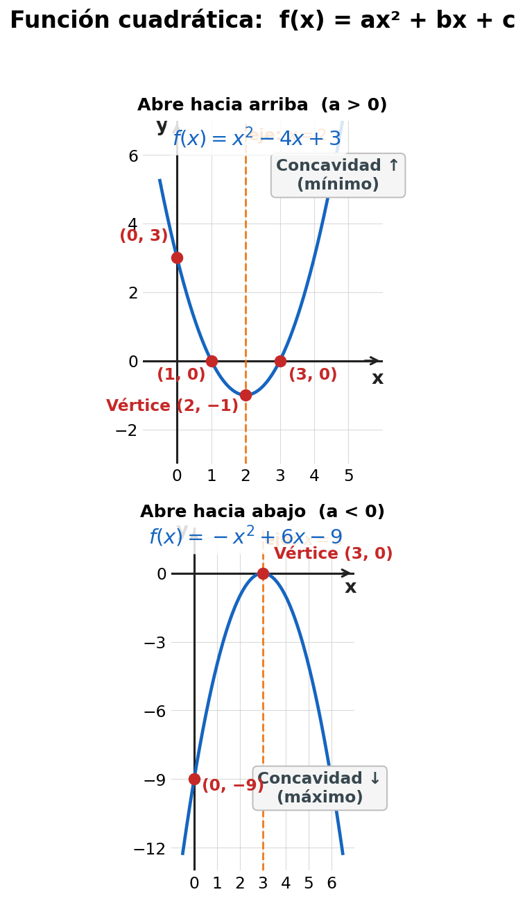
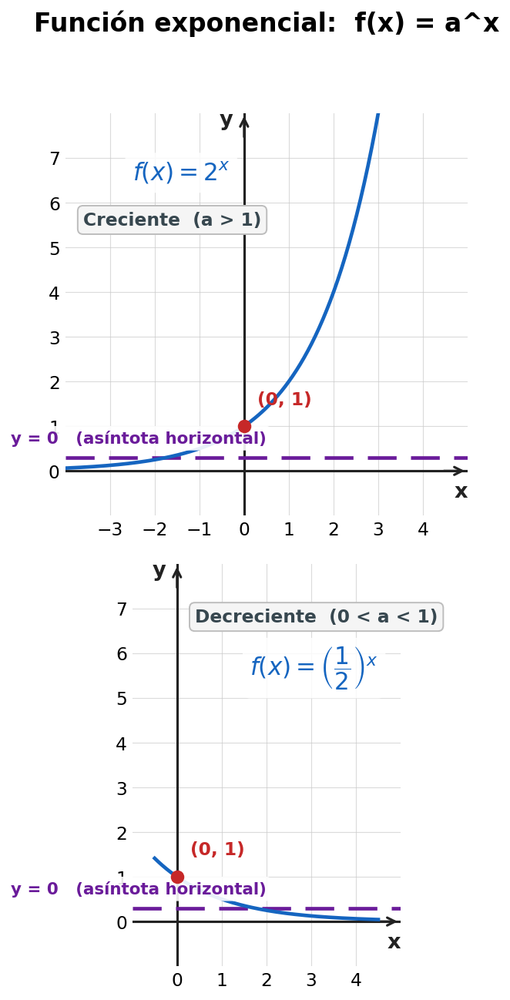
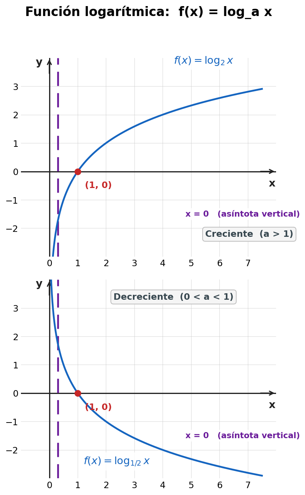

# Temas Básicos: Plano Cartesiano, Relaciones, Funciones e Inecuaciones

Una guía de referencia rápida que reúne los conceptos fundamentales sobre el plano cartesiano, las relaciones y funciones (lineal, cuadrática, exponencial y logarítmica), los sistemas de ecuaciones 2×2, los intervalos y las inecuaciones lineales. Los ejemplos están tomados de la **[`Guia_Unidad_IV.pdf`](./Guia_Unidad_IV.pdf)** del curso **Matemática I (MM-112)** de la UNAH; cuando aplica se indica entre paréntesis el inciso de la guía del que proviene cada ejercicio.

---

## 1. Plano de coordenadas cartesianas

### 1.1 Construcción del plano cartesiano

El **plano cartesiano** se construye trazando dos rectas numéricas perpendiculares entre sí que se cruzan en un punto llamado **origen**, denotado $O = (0, 0)$:

- **Eje X (eje de las abscisas):** horizontal.
- **Eje Y (eje de las ordenadas):** vertical.

Los ejes dividen al plano en **cuatro regiones** llamadas **cuadrantes**, numerados en sentido antihorario a partir del superior derecho.

| Cuadrante | Abscisa $x$ | Ordenada $y$ |
|:---------:|:-----------:|:------------:|
| I         | $x > 0$     | $y > 0$      |
| II        | $x < 0$     | $y > 0$      |
| III       | $x < 0$     | $y < 0$      |
| IV        | $x > 0$     | $y < 0$      |

### 1.2 Ubicación de puntos

Cada punto del plano se representa mediante un **par ordenado** $(x, y)$. Si la primera coordenada es $0$ el punto está **sobre el eje Y**; si la segunda es $0$ está **sobre el eje X**.

**Ejemplo 0** (introductorio, con animación):

La siguiente animación muestra cómo se construye el plano cartesiano, dónde quedan los cuatro cuadrantes según el signo de las coordenadas, y cómo se traza un punto dado a partir de su abscisa y su ordenada. Los tres ejemplos del video son los mismos que desarrollamos abajo: $(3, 2)$, $(-2, 3)$ y $(-3, -2)$.

<video src="./plano_cartesiano.mp4" controls width="100%"></video>

**Ejemplo 1 (guía, inciso 1.a):** $A = (2, 3)$ está en el **cuadrante I** (abscisa positiva, ordenada positiva).

**Ejemplo 2 (guía, inciso 1.b):** $B = (-4, -5)$ está en el **cuadrante III** (ambas coordenadas negativas).

**Ejemplo 3 (guía, inciso 1.c):** $C = \left(\dfrac{3}{2},\ -2\right)$ está en el **cuadrante IV** (la abscisa es positiva aunque es fracción; la ordenada es negativa).

**Ejemplo 4 (guía, inciso 1.e):** $D = (-6, 4)$ está en el **cuadrante II**.

**Ejemplo 5 (guía, incisos 1.h y 1.k):** $E = (0, -10)$ está **sobre el eje Y** (no en un cuadrante); $F = (10, 0)$ está **sobre el eje X**.

**Ejemplo 6 (guía, inciso 1.p):** $G = \left(-\dfrac{8}{5},\ -3\right)$ está en el **cuadrante III** (ambas coordenadas negativas, la abscisa es fracción negativa).

### 1.3 Distancia entre dos puntos

Dados dos puntos $P_1 = (x_1, y_1)$ y $P_2 = (x_2, y_2)$, la **distancia** entre ellos es:

$$
d(P_1, P_2) = \sqrt{(x_2 - x_1)^2 + (y_2 - y_1)^2}
$$

Esta fórmula se deduce directamente del **teorema de Pitágoras**.

**Ejemplo 1 (guía, inciso 2.a):** Distancia entre $A = (1, 2)$ y $B = (4, 6)$.

$$
d(A, B) = \sqrt{(4-1)^2 + (6-2)^2} = \sqrt{3^2 + 4^2} = \sqrt{9 + 16} = \sqrt{25} = 5
$$

**Ejemplo 2 (guía, inciso 2.b):** Distancia entre $A = (-3, 5)$ y $B = (2, -1)$.

$$
d(A, B) = \sqrt{(2-(-3))^2 + (-1-5)^2} = \sqrt{5^2 + (-6)^2} = \sqrt{25 + 36} = \sqrt{61}
$$

**Ejemplo 3 (guía, inciso 2.c):** Distancia entre $A = \left(\dfrac{1}{2},\ -2\right)$ y $B = \left(\dfrac{3}{2},\ 4\right)$.

$$
d(A, B) = \sqrt{\left(\tfrac{3}{2} - \tfrac{1}{2}\right)^2 + (4-(-2))^2} = \sqrt{1^2 + 6^2} = \sqrt{1 + 36} = \sqrt{37}
$$

### 1.4 Punto medio de un segmento

El **punto medio** $M$ del segmento que une $P_1 = (x_1, y_1)$ y $P_2 = (x_2, y_2)$ es:

$$
M = \left( \frac{x_1 + x_2}{2},\ \frac{y_1 + y_2}{2} \right)
$$

**Ejemplo 1 (guía, inciso 2.a):** Punto medio entre $A = (1, 2)$ y $B = (4, 6)$.

$$
M = \left(\frac{1+4}{2},\ \frac{2+6}{2}\right) = \left(\frac{5}{2},\ 4\right)
$$

**Ejemplo 2 (guía, inciso 2.b):** Punto medio entre $A = (-3, 5)$ y $B = (2, -1)$.

$$
M = \left(\frac{-3+2}{2},\ \frac{5+(-1)}{2}\right) = \left(-\frac{1}{2},\ 2\right)
$$

**Ejemplo 3 (guía, inciso 2.k):** Punto medio entre $A = (5, 5)$ y $B = (-5, -5)$.

$$
M = \left(\frac{5+(-5)}{2},\ \frac{5+(-5)}{2}\right) = (0,\ 0)
$$

> 💡 El segmento que une un punto con su **opuesto** $(-x, -y)$ siempre tiene al **origen** como punto medio.

### 1.5 Producto cartesiano

Dados dos conjuntos $A$ y $B$, el **producto cartesiano** $A \times B$ es el conjunto de **todos los pares ordenados** cuyo primer elemento pertenece a $A$ y el segundo pertenece a $B$:

$$
A \times B = \{ (a, b) \mid a \in A,\ b \in B \}
$$

> **Propiedades:**
> - Si $A$ tiene $m$ elementos y $B$ tiene $n$ elementos, entonces $A \times B$ tiene $m \cdot n$ elementos.
> - En general, $A \times B \neq B \times A$ (el producto cartesiano **no es conmutativo**), salvo que $A = B$.

**Ejemplo 1:** $A = \{1, 2\}$ y $B = \{x, y\}$.

$$
A \times B = \{(1, x),\ (1, y),\ (2, x),\ (2, y)\}, \qquad |A \times B| = 2 \cdot 2 = 4
$$

**Ejemplo 2:** Tomando los dominios de dos ejercicios de la guía, $A = \{1, 2, 3\}$ (dominio del inciso 3.a) y $B = \{a, b, c\}$ (codominio del inciso 3.a). Entonces $A \times B$ tiene $3 \cdot 3 = 9$ elementos.

---

## 2. Relaciones y Función: definiciones fundamentales

### 2.1 Relación

Dados dos conjuntos $A$ y $B$, una **relación** $R$ de $A$ en $B$ es cualquier **subconjunto** del producto cartesiano $A \times B$:

$$
R \subseteq A \times B
$$

Una relación puede representarse de cuatro formas: mediante un **diagrama de flechas**, un **diagrama de Venn**, una **gráfica de puntos** en el plano cartesiano o un **conjunto de pares ordenados**.

### 2.2 Función: definición

Una **función** $f : A \to B$ es una relación que cumple una condición especial:

> **Cada elemento de $A$ se relaciona con exactamente un elemento de $B$.**

Es decir, en una función **no puede haber** dos pares ordenados que compartan la misma primera coordenada.

### 2.3 Notación de una función

Las notaciones más usadas son:

| Notación | Lectura |
|----------|---------|
| $f : A \to B$ | Función $f$ de $A$ en $B$ |
| $f(x)$ | "f de $x$" (imagen de $x$) |
| $y = f(x)$ | $y$ es la imagen de $x$ |
| $(x, y) \in f$ | El par $(x, y)$ pertenece a la función |

**Ejemplo (guía, inciso 3.b):** $f : \{-1, 0, 1\} \to \{2, 4, 6\}$ con $R = \{(-1, 2), (0, 4), (1, 6)\}$. La notación $f(0) = 4$ indica que la imagen de $0$ es $4$.

### 2.4 Formas de representación de una función

Una misma función puede escribirse de cuatro maneras distintas:

1. **Verbal (descripción):** "El doble de un número menos tres."
2. **Algebraica (fórmula):** $f(x) = 2x - 3$.
3. **Tabla de valores** (ver §2.6).
4. **Gráfica:** conjunto de puntos $(x, f(x))$ en el plano cartesiano.

### 2.5 Dominio, rango, imagen y preimagen

- **Dominio** ($\text{Dom}\, f$): conjunto de **todos los valores de entrada** (primeras coordenadas).
- **Rango** ($\text{Rang}\, f$) o **Imagen** ($\text{Im}\, f$): conjunto de **todos los valores de salida** (segundas coordenadas).
- **Imagen de $x$:** es el valor $f(x)$ que la función asigna a $x$.
- **Preimagen de $y$:** es cualquier valor $x$ tal que $f(x) = y$.

> ⚠️ **Imagen vs. preimagen:** si $y = f(x)$, entonces $y$ es la **imagen** de $x$, y $x$ es la **preimagen** de $y$.

### 2.6 Función discreta: dominio y rango (de la guía, sección 4)

Una función es **discreta** cuando su **dominio es un conjunto finito o numerable**. Se representa con **puntos aislados**, no con una línea continua. La guía propone los siguientes ejercicios para practicar la lectura del dominio y el rango.

**Ejemplo 1 (guía, inciso 4.a):**

$$
f = \{(-3,\ 4),\ (-2,\ 1),\ (0,\ 5),\ (1,\ -1),\ (3,\ 7)\}
$$

$$
\text{Dom}\, f = \{-3,\ -2,\ 0,\ 1,\ 3\}, \qquad \text{Rang}\, f = \{-1,\ 1,\ 4,\ 5,\ 7\}
$$

**Ejemplo 2 (guía, inciso 4.k):**

$$
s = \{(0,\ 0),\ (1,\ 2),\ (2,\ 4),\ (3,\ 6),\ (4,\ 8)\}
$$

$$
\text{Dom}\, s = \{0,\ 1,\ 2,\ 3,\ 4\}, \qquad \text{Rang}\, s = \{0,\ 2,\ 4,\ 6,\ 8\}
$$

> 💡 Esta función responde a la fórmula $s(x) = 2x$: por cada aumento de $1$ en $x$, la imagen aumenta en $2$. Es una función lineal discreta.

**Ejemplo 3 (guía, inciso 4.ñ):**

$$
w = \{(-4,\ -4),\ (-2,\ -2),\ (0,\ 0),\ (2,\ 2),\ (4,\ 4)\}
$$

$$
\text{Dom}\, w = \text{Rang}\, w = \{-4,\ -2,\ 0,\ 2,\ 4\}
$$

> 💡 En este caso el dominio y el rango **coinciden**; la función responde a $w(x) = x$ (función identidad discreta).

### 2.7 ¿Cómo saber si una relación es función? (de la guía, sección 3)

La guía propone 15 relaciones para clasificar. La regla es: **cada elemento del dominio debe aparecer exactamente una vez como primera coordenada**. Si un mismo elemento aparece dos veces con imágenes distintas, **no es función**.

**Es función:**

| Inciso | Relación | Justificación |
|:------:|----------|---------------|
| 3.a | $R = \{(1, a),\ (2, b),\ (3, c)\}$ | Cada elemento de $A$ aparece **una sola vez** |
| 3.c | $R = \{(x, r),\ (y, s),\ (z, r)\}$ | Aunque $r$ se repite como imagen, **cada elemento del dominio tiene solo una imagen** |
| 3.e | $R = \{(a, 1),\ (b, 2),\ (c, 1)\}$ | $1$ se repite como imagen, pero no hay elemento del dominio repetido |
| 3.h | $R = \{(\text{perro, ladrar}),\ (\text{gato, maullar})\}$ | Cada animal produce **un único sonido** |

**No es función:**

| Inciso | Relación | Justificación |
|:------:|----------|---------------|
| 3.d | $R = \{(2, 1),\ (4, 3),\ (2, 5)\}$ | El elemento $2$ aparece **dos veces** con imágenes distintas ($1$ y $5$) |
| 3.f | $R = \{(1, x),\ (2, y),\ (3, z),\ (1, y)\}$ | El elemento $1$ aparece **dos veces** con imágenes distintas ($x$ e $y$) |
| 3.j | $R = \{(1, a),\ (1, b),\ (2, c)\}$ | El elemento $1$ tiene **dos imágenes** ($a$ y $b$) |
| 3.o | $R = \{(\text{rojo, manzana}),\ (\text{verde, árbol}),\ (\text{azul, cielo})\}$ | "cielo" **no pertenece a** $B = \{\text{manzana, árbol}\}$ |

### 2.8 Criterio de la recta vertical

> **Regla:** Una gráfica en el plano cartesiano representa una función **si y solo si** toda recta vertical corta a la gráfica **a lo sumo en un punto**.

Si existe una recta vertical que corta la gráfica en dos o más puntos, entonces **no es una función** (hay un valor de $x$ con dos imágenes distintas).

**Ejemplo 1:** La parábola $y = x^2$ **sí es función**: cualquier recta vertical $x = c$ la corta a lo sumo en un punto: $(c, c^2)$.

**Ejemplo 2:** La circunferencia $x^2 + y^2 = 1$ **no es función** (no es $y = f(x)$): la recta vertical $x = 0$ la corta en $(0, 1)$ y en $(0, -1)$.

---

## 3. Función lineal

### 3.1 Definición

Una **función lineal** es una función de la forma:

$$
f(x) = mx + b
$$

donde $m, b \in \mathbb{R}$, con $m$ llamada **pendiente** y $b$ el **intercepto con el eje Y**.

> Si $b = 0$, la función $f(x) = mx$ se llama **función lineal homogénea** (o **proporcionalidad directa**) y su gráfica pasa por el origen.

### 3.2 Gráfica, interceptos, dominio, rango y monotonía

La gráfica de una función lineal es una **recta**. Basta con conocer dos puntos cualesquiera para trazarla. Para una función lineal no constante ($m \neq 0$):

| Elemento | Resultado |
|----------|-----------|
| **Gráfica** | Una recta |
| **Intercepto con el eje Y** | $(0,\ b)$ |
| **Intercepto con el eje X** | $\left(-\dfrac{b}{m},\ 0\right)$ (si $m \neq 0$) |
| **Dominio** | $\mathbb{R}$ |
| **Rango** | $\mathbb{R}$ |
| **Monotonía** | Creciente si $m > 0$; decreciente si $m < 0$; constante si $m = 0$ |

**Ejemplo 1 (guía, inciso 5.a):** $f(x) = 2x + 3$.

- $m = 2 > 0$ → **creciente**.
- Intercepto Y: $(0, 3)$.
- Intercepto X: $2x + 3 = 0 \Rightarrow x = -\dfrac{3}{2}$ → $\left(-\dfrac{3}{2},\ 0\right)$.

**Ejemplo 2 (guía, inciso 5.d):** $f(x) = -\dfrac{2}{3}x + 4$.

- $m = -\dfrac{2}{3} < 0$ → **decreciente**.
- Intercepto Y: $(0, 4)$.
- Intercepto X: $-\dfrac{2}{3}x + 4 = 0 \Rightarrow x = 6$ → $(6,\ 0)$.

**Ejemplo 3 (guía, inciso 5.g):** $f(x) = 3x + \dfrac{5}{2}$.

- $m = 3 > 0$ → **creciente**.
- Intercepto Y: $\left(0,\ \dfrac{5}{2}\right)$.
- Intercepto X: $3x + \dfrac{5}{2} = 0 \Rightarrow x = -\dfrac{5}{6}$ → $\left(-\dfrac{5}{6},\ 0\right)$.

### 3.3 Ecuación de la recta conocido un punto y la pendiente

Cuando se conoce un punto $A = (x_0, y_0)$ por donde pasa la recta y su pendiente $m$, la **ecuación punto-pendiente** es:

$$
y - y_0 = m\,(x - x_0)
$$

**Ejemplo 1 (guía, inciso 6.a):** Recta que pasa por $A = (1, 2)$ con $m = 3$.

$$
y - 2 = 3\,(x - 1) \;\Longrightarrow\; y = 3x - 3 + 2 \;\Longrightarrow\; y = 3x - 1
$$

**Ejemplo 2 (guía, inciso 6.d):** Recta que pasa por $A = (0, 5)$ con $m = -\dfrac{1}{2}$.

$$
y - 5 = -\tfrac{1}{2}\,(x - 0) \;\Longrightarrow\; y = -\tfrac{1}{2}\,x + 5
$$

> 💡 Como $x_0 = 0$, la ecuación queda directamente en la forma $y = mx + b$, con $b = 5$.

### 3.4 Ecuación de la recta conocidos dos puntos

Dados $A = (x_1, y_1)$ y $B = (x_2, y_2)$ con $x_1 \neq x_2$, primero se calcula la pendiente:

$$
m = \frac{y_2 - y_1}{x_2 - x_1}
$$

y luego se aplica la forma punto-pendiente con cualquiera de los dos puntos.

**Ejemplo 1 (guía, inciso 7.a):** Recta por $A = (1, 2)$ y $B = (3, 6)$.

$$
m = \frac{6 - 2}{3 - 1} = \frac{4}{2} = 2
$$

$$
y - 2 = 2\,(x - 1) \;\Longrightarrow\; y = 2x
$$

> 💡 Como la recta pasa por el origen, $b = 0$: es una función lineal homogénea.

**Ejemplo 2 (guía, inciso 7.i):** Recta por $A = (2, -3)$ y $B = (4, 1)$.

$$
m = \frac{1 - (-3)}{4 - 2} = \frac{4}{2} = 2
$$

$$
y - 1 = 2\,(x - 4) \;\Longrightarrow\; y = 2x - 7
$$

---

## 4. Sistemas de ecuaciones lineales 2×2

### 4.1 Definición

Un **sistema de ecuaciones lineales 2×2** es un conjunto de dos ecuaciones con dos incógnitas $x$ e $y$:

$$
\begin{cases} a_1 x + b_1 y = c_1 \\ a_2 x + b_2 y = c_2 \end{cases}
$$

Resolver el sistema significa hallar todos los pares $(x, y)$ que satisfacen **ambas** ecuaciones simultáneamente.

### 4.2 Clasificación según el tipo de solución

| Tipo | Condición sobre coeficientes | Solución |
|------|------------------------------|----------|
| **Compatible determinado** | $\dfrac{a_1}{a_2} \neq \dfrac{b_1}{b_2}$ | Una única solución |
| **Compatible indeterminado** | $\dfrac{a_1}{a_2} = \dfrac{b_1}{b_2} = \dfrac{c_1}{c_2}$ | Infinitas soluciones (las ecuaciones son proporcionales) |
| **Incompatible** | $\dfrac{a_1}{a_2} = \dfrac{b_1}{b_2} \neq \dfrac{c_1}{c_2}$ | No tiene solución |

Geométricamente:
- **Determinado:** las dos rectas se cortan en **un punto**.
- **Indeterminado:** las dos rectas son **la misma** (coinciden).
- **Incompatible:** las dos rectas son **paralelas** y distintas.

### 4.3 Método de sustitución

**Pasos:**
1. Se **despeja** una de las variables de una de las ecuaciones.
2. Se **sustituye** esa expresión en la otra ecuación.
3. Se **resuelve** la ecuación resultante (queda una sola incógnita).
4. Se **sustituye** el valor obtenido en la ecuación del paso 1.

**Ejemplo (guía, inciso 8.d):** Resolver $\begin{cases} -x + y = 2 \\ 2x + 3y = 1 \end{cases}$.

De la primera ecuación despejamos $y$:

$$
y = 2 + x
$$

Sustituimos en la segunda:

$$
2x + 3(2 + x) = 1 \;\Longrightarrow\; 2x + 6 + 3x = 1 \;\Longrightarrow\; 5x = -5 \;\Longrightarrow\; x = -1
$$

Sustituimos de vuelta: $y = 2 + (-1) = 1$. **Solución:** $(x, y) = (-1, 1)$.

### 4.4 Método de eliminación (suma y resta)

**Pasos:**
1. Se **multiplican** las ecuaciones (si es necesario) para que los coeficientes de una de las variables sean **opuestos**.
2. Se **suman** las ecuaciones: esa variable se elimina.
3. Se **resuelve** la ecuación resultante.
4. Se **sustituye** el valor obtenido en cualquiera de las ecuaciones originales.

**Ejemplo (guía, inciso 8.g):** Resolver $\begin{cases} x - y = 4 \\ 2x + y = 5 \end{cases}$.

Los coeficientes de $y$ ya son opuestos ($-1$ y $+1$). Sumamos ambas ecuaciones:

$$
(x - y) + (2x + y) = 4 + 5 \;\Longrightarrow\; 3x = 9 \;\Longrightarrow\; x = 3
$$

Sustituimos en la primera: $3 - y = 4 \Rightarrow y = -1$. **Solución:** $(x, y) = (3, -1)$.

### 4.5 Representación gráfica

Cada ecuación del sistema representa una **recta** en el plano cartesiano. La solución del sistema es el **punto de intersección** de ambas rectas.

**Ejemplo (gráfico de los dos sistemas anteriores):**

- Para $\begin{cases} -x + y = 2 \\ 2x + 3y = 1 \end{cases}$: las rectas $y = x + 2$ e $y = \dfrac{1 - 2x}{3}$ se cortan en $(-1, 1)$.
- Para $\begin{cases} x - y = 4 \\ 2x + y = 5 \end{cases}$: las rectas $y = x - 4$ e $y = 5 - 2x$ se cortan en $(3, -1)$.

> 💡 En ambos casos el sistema es **compatible determinado**: las rectas no son paralelas y se cortan en un único punto.

---

## 5. Función cuadrática

### 5.1 Definición

Una **función cuadrática** es una función de la forma:

$$
f(x) = ax^2 + bx + c
$$

donde $a, b, c \in \mathbb{R}$ con $a \neq 0$.

### 5.2 Gráfica: la parábola

La gráfica de una función cuadrática es una **parábola**, una curva en forma de "U" o de "U invertida".

### 5.3 Elementos principales

#### Concavidad

Depende del signo de $a$:

- Si $a > 0$: la parábola abre **hacia arriba** (forma de ∪) → tiene un **mínimo**.
- Si $a < 0$: la parábola abre **hacia abajo** (forma de ∩) → tiene un **máximo**.

#### Vértice

El **vértice** es el punto donde la parábola alcanza su valor máximo o mínimo. Sus coordenadas son:

$$
V = \left( -\frac{b}{2a},\ c - \frac{b^2}{4a} \right) = \left( -\frac{b}{2a},\ f\!\left(-\frac{b}{2a}\right) \right)
$$

#### Eje de simetría

Es la **recta vertical** que pasa por el vértice y divide la parábola en dos mitades simétricas:

$$
x = -\frac{b}{2a}
$$

#### Interceptos

| Eje | Cálculo | Punto(s) |
|-----|---------|----------|
| Eje Y (con $x = 0$) | $f(0) = c$ | $(0,\ c)$ |
| Eje X (con $f(x) = 0$) | Soluciones de $ax^2 + bx + c = 0$ | Según el **discriminante** $D = b^2 - 4ac$ |

El **discriminante** $D = b^2 - 4ac$ indica la cantidad de intersecciones con el eje X:

| Discriminante | Raíces reales | Interceptos con el eje X |
|:-------------:|:-------------:|:------------------------:|
| $D > 0$ | Dos raíces distintas | **Dos** puntos |
| $D = 0$ | Una raíz doble | **Un** punto (la parábola es tangente al eje X) |
| $D < 0$ | Ninguna raíz real | **Ninguno** (la parábola no toca el eje X) |

#### Valor máximo o mínimo

El valor de la función en el vértice es:

$$
f(V) = c - \frac{b^2}{4a}
$$

- Si $a > 0$: es el **valor mínimo** de la función.
- Si $a < 0$: es el **valor máximo** de la función.

### 5.4 Dominio y rango

| Elemento | Resultado |
|----------|-----------|
| **Dominio** | $\text{Dom}\, f = \mathbb{R}$ |
| **Rango** | Si $a > 0$: $\text{Rang}\, f = \left[c - \dfrac{b^2}{4a},\ +\infty\right)$   Si $a < 0$: $\text{Rang}\, f = \left(-\infty,\ c - \dfrac{b^2}{4a}\right]$ |

### 5.5 Ejemplos resueltos (de la guía, sección 9)

**Ejemplo 1 (guía, inciso 9.a):** $f(x) = x^2 - 4x + 3$.

- $a = 1 > 0$: **abre hacia arriba** → tiene **mínimo**.
- Vértice: $V = \left(-\dfrac{-4}{2(1)},\ f(2)\right) = (2,\ -1)$.
- Eje de simetría: $x = 2$.
- Intercepto con Y: $(0, 3)$.
- Interceptos con X: $x^2 - 4x + 3 = 0 \Rightarrow (x-1)(x-3) = 0 \Rightarrow$ puntos $(1, 0)$ y $(3, 0)$.
- Valor mínimo: $f(2) = -1$.
- Dominio: $\mathbb{R}$. Rango: $[-1, +\infty)$.

**Ejemplo 2 (guía, inciso 9.d):** $f(x) = -x^2 + 6x - 9 = -(x-3)^2$.

- $a = -1 < 0$: **abre hacia abajo** → tiene **máximo**.
- Vértice: $V = \left(-\dfrac{6}{2(-1)},\ f(3)\right) = (3,\ 0)$.
- Eje de simetría: $x = 3$.
- Intercepto con Y: $(0, -9)$.
- Interceptos con X: $D = 36 - 36 = 0$, raíz doble $x = 3$ → punto $(3, 0)$. La parábola es **tangente al eje X** (solo lo toca, no lo cruza).
- Valor máximo: $f(3) = 0$.
- Dominio: $\mathbb{R}$. Rango: $(-\infty, 0]$.

**Ejemplo 3 (guía, inciso 9.k):** $f(x) = x^2 - 2x = x(x - 2)$.

- $a = 1 > 0$: **abre hacia arriba** → tiene **mínimo**.
- Vértice: $V = \left(-\dfrac{-2}{2(1)},\ f(1)\right) = (1,\ -1)$.
- Eje de simetría: $x = 1$.
- Intercepto con Y: $(0, 0)$ (también es intercepto con X).
- Interceptos con X: $x(x-2) = 0 \Rightarrow$ puntos $(0, 0)$ y $(2, 0)$.
- Valor mínimo: $f(1) = -1$.
- Dominio: $\mathbb{R}$. Rango: $[-1, +\infty)$.

> 💡 **Comparación:** los ejemplos 1 y 3 tienen la misma concavidad y el mismo mínimo ($-1$); se diferencian en que el primero corta el eje Y arriba del vértice, mientras que el tercero pasa por el origen.

---

## 6. Intervalos

### 6.1 Definición

Un **intervalo** es un **subconjunto continuo** de la recta real, es decir, un conjunto donde entre dos elementos cualesquiera del mismo están todos los números intermedios.

### 6.2 Clasificación

Sean $a, b \in \mathbb{R}$ con $a < b$. Existen cuatro tipos básicos:

| Tipo | Notación | Significado | Representación en la recta |
|------|----------|-------------|----------------------------|
| **Abierto** | $(a, b)$ | $\{x \in \mathbb{R} \mid a < x < b\}$ | ○————○ (extremos **excluidos**) |
| **Cerrado** | $[a, b]$ | $\{x \in \mathbb{R} \mid a \leq x \leq b\}$ | ●————● (extremos **incluidos**) |
| **Semiabierto por la izquierda** | $(a, b]$ | $\{x \in \mathbb{R} \mid a < x \leq b\}$ | ○————● |
| **Semiabierto por la derecha** | $[a, b)$ | $\{x \in \mathbb{R} \mid a \leq x < b\}$ | ●————○ |

> Los círculos **rellenos (●)** indican que el extremo **sí está incluido**; los círculos **vacíos (○)** indican que el extremo **no está incluido**.

### 6.3 Intervalos infinitos

Cuando uno o ambos extremos se extienden hasta el infinito, se usan los símbolos $+\infty$ o $-\infty$ (que **siempre** van acompañados de paréntesis, ya que el infinito no es un número):

| Notación | Significado |
|----------|-------------|
| $(a, +\infty)$ | $\{x \in \mathbb{R} \mid x > a\}$ |
| $[a, +\infty)$ | $\{x \in \mathbb{R} \mid x \geq a\}$ |
| $(-\infty, b)$ | $\{x \in \mathbb{R} \mid x < b\}$ |
| $(-\infty, b]$ | $\{x \in \mathbb{R} \mid x \leq b\}$ |
| $(-\infty, +\infty)$ | $\mathbb{R}$ (toda la recta real) |

### 6.4 Distintas notaciones para el mismo intervalo

**Ejemplo:** El conjunto de números reales mayores o iguales que $-2$ y menores que $5$ puede escribirse como:

| Notación | Forma |
|----------|-------|
| **Conjunto** | $\{x \in \mathbb{R} \mid -2 \leq x < 5\}$ |
| **Intervalo** | $[-2, 5)$ |
| **Desigualdad** | $-2 \leq x < 5$ |
| **En la recta** | ●━━━━━○ |
| **Verbal** | "desde $-2$ (incluido) hasta $5$ (sin incluir)" |

---

## 7. Inecuaciones

### 7.1 Concepto

Una **inecuación** es una **desigualdad** entre dos expresiones algebraicas. A diferencia de una ecuación, la solución **no es un valor único** sino un **conjunto de valores** que hacen verdadera la desigualdad.

Los símbolos de desigualdad son:

| Símbolo | Significado |
|:-------:|:-----------:|
| $<$     | menor que   |
| $>$     | mayor que   |
| $\leq$  | menor o igual que |
| $\geq$  | mayor o igual que |

### 7.2 Resolución de inecuaciones lineales

Una **inecuación lineal** es aquella en la que la variable aparece con exponente $1$. Se resuelve de manera similar a una ecuación lineal, pero con una **regla adicional fundamental**:

> ⚠️ **Regla fundamental:** Si se multiplican o dividen **ambos miembros** por un número **negativo**, el sentido de la desigualdad **se invierte**.

**Pasos generales:**
1. Eliminar denominadores (multiplicar por el m.c.m.).
2. Eliminar paréntesis (propiedad distributiva).
3. Agrupar términos con la variable en un miembro y constantes en el otro.
4. Reducir hasta obtener la forma $ax \lessgtr b$.
5. Despejar $x$ (recordando invertir el signo si se divide entre un negativo).
6. Expresar el **conjunto solución** en notación de intervalo o de conjunto.

### 7.3 Ejemplos resueltos (de la guía, secciones 10, 11 y 13)

**Ejemplo 1 (guía, inciso 10.a):** Resolver $3x + 5 < 20$.

$$
3x < 20 - 5 \;\Longrightarrow\; 3x < 15 \;\Longrightarrow\; x < 5
$$

**Conjunto solución:** $S = (-\infty,\ 5)$.

**Ejemplo 2 (guía, inciso 10.c):** Resolver $-4x + 6 \leq 2$.

$$
-4x \leq 2 - 6 \;\Longrightarrow\; -4x \leq -4
$$

Dividimos entre $-4$ **(negativo, se invierte el signo)**:

$$
x \geq 1
$$

**Conjunto solución:** $S = [1,\ +\infty)$.

**Ejemplo 3 (guía, inciso 10.e):** Resolver $-5x + 9 \geq -6$.

$$
-5x \geq -6 - 9 \;\Longrightarrow\; -5x \geq -15
$$

Dividimos entre $-5$ **(negativo, se invierte el signo)**:

$$
x \leq 3
$$

**Conjunto solución:** $S = (-\infty,\ 3]$.

**Ejemplo 4 (guía, inciso 11.a):** Resolver $2x + \dfrac{1}{2} < \dfrac{5}{2}$.

$$
2x < \tfrac{5}{2} - \tfrac{1}{2} \;\Longrightarrow\; 2x < 2 \;\Longrightarrow\; x < 1
$$

**Conjunto solución:** $S = (-\infty,\ 1)$.

**Ejemplo 5 (guía, inciso 11.b):** Resolver $-3x - \dfrac{2}{3} \geq \dfrac{7}{3}$.

$$
-3x \geq \tfrac{7}{3} + \tfrac{2}{3} \;\Longrightarrow\; -3x \geq 3
$$

Dividimos entre $-3$ **(negativo, se invierte el signo)**:

$$
x \leq -1
$$

**Conjunto solución:** $S = (-\infty,\ -1]$.

**Ejemplo 6 (guía, inciso 12.a):** Resolver $\dfrac{1}{2}x + \dfrac{3}{4} < \dfrac{7}{8}$.

Multiplicamos ambos miembros por el m.c.m. $= 8$:

$$
4x + 6 < 7 \;\Longrightarrow\; 4x < 1 \;\Longrightarrow\; x < \tfrac{1}{4}
$$

**Conjunto solución:** $S = \left(-\infty,\ \dfrac{1}{4}\right)$.

**Ejemplo 7 (guía, inciso 13.a):** Resolver $2(x + 3) - 4 < 3(x - 1) + 2$.

Aplicamos la propiedad distributiva:

$$
2x + 6 - 4 < 3x - 3 + 2 \;\Longrightarrow\; 2x + 2 < 3x - 1
$$

Pasamos los términos con $x$ al miembro izquierdo y las constantes al derecho:

$$
2 < 3x - 2x - 1 \;\Longrightarrow\; 2 + 1 < x \;\Longrightarrow\; 3 < x
$$

**Conjunto solución:** $S = (3,\ +\infty)$.

**Ejemplo 8 (guía, inciso 13.b):** Resolver $5(x - 2) + 3 \geq 2(x + 4) - 1$.

$$
5x - 10 + 3 \geq 2x + 8 - 1 \;\Longrightarrow\; 5x - 7 \geq 2x + 7
$$

$$
3x \geq 14 \;\Longrightarrow\; x \geq \tfrac{14}{3}
$$

**Conjunto solución:** $S = \left[\dfrac{14}{3},\ +\infty\right)$.

---

## 8. Función exponencial

> ⚠️ **Nota:** Este tema aparece dos veces en la lista original (numerado como 8 y como 9). Se desarrolla una sola vez aquí.

### 8.1 Definición

Una **función exponencial** es una función de la forma:

$$
f(x) = a^x
$$

donde la **base** $a$ es una constante real que cumple $a > 0$ y $a \neq 1$, y $x$ es el **exponente** (la variable independiente).

> Las funciones exponenciales más utilizadas son $f(x) = e^x$ (base $e \approx 2.71828$) y $f(x) = 10^x$.

### 8.2 Elementos principales (en general)

| Elemento | Resultado |
|----------|-----------|
| **Dominio** | $\text{Dom}\, f = \mathbb{R}$ |
| **Rango** | $\text{Rang}\, f = (0,\ +\infty)$ (siempre positivos, **nunca** $\leq 0$) |
| **Intercepto con Y** | $(0,\ 1)$ porque $a^0 = 1$ |
| **Intercepto con X** | **Ninguno** (la gráfica nunca toca al eje X) |
| **Asíntota** | El **eje X**, $y = 0$. La curva se acerca a $y = 0$ sin tocarlo |
| **Monotonía** | Creciente si $a > 1$; decreciente si $0 < a < 1$ |

### 8.3 Ejemplos resueltos (de la guía, sección 15)

Los ejercicios de la guía involucran **transformaciones** de la forma $f(x) = a^{g(x)} + k$: la base $a$ y el exponente $g(x)$ cambian la posición y la forma de la gráfica; las constantes sumadas la trasladan.

**Ejemplo 1 (guía, inciso 15.a):** $f(x) = 2^{x+1} - 1$.

- Base $2 > 1$, sin signo negativo → **creciente**.
- Asíntota horizontal: $y = -1$ (desplazamiento vertical $-1$).
- Intercepto con Y: $f(0) = 2^{0+1} - 1 = 2 - 1 = 1 \Rightarrow (0,\ 1)$.
- Intercepto con X: $2^{x+1} - 1 = 0 \Rightarrow 2^{x+1} = 1 \Rightarrow x + 1 = 0 \Rightarrow x = -1 \Rightarrow (-1,\ 0)$.

**Ejemplo 2 (guía, inciso 15.e):** $f(x) = 3^{x-2}$.

- Base $3 > 1$ → **creciente**.
- Asíntota horizontal: $y = 0$.
- Intercepto con Y: $f(0) = 3^{0-2} = 3^{-2} = \dfrac{1}{9} \Rightarrow \left(0,\ \dfrac{1}{9}\right)$.
- Intercepto con X: $3^{x-2} = 1 \Rightarrow x - 2 = 0 \Rightarrow x = 2 \Rightarrow (2,\ 0)$.

**Ejemplo 3 (guía, inciso 15.m):** $f(x) = 2^{-x+1} + 1$.

- El exponente $-x+1 = -(x-1)$ hace que cuando $x$ crece, el exponente **decrece** → la función es **decreciente**.
- Asíntota horizontal: $y = 1$.
- Intercepto con Y: $f(0) = 2^{-0+1} + 1 = 2 + 1 = 3 \Rightarrow (0,\ 3)$.
- Intercepto con X: $2^{-x+1} + 1 = 0 \Rightarrow 2^{-x+1} = -1$ → **no existe** (la función siempre es mayor que $1$).

**Ejemplo 4 (guía, inciso 15.j):** $f(x) = -2^{2x-1}$.

- El signo negativo invierte la gráfica con respecto al eje X. La función es siempre **negativa**.
- **Decreciente**: cuando $x$ crece, $2^{2x-1}$ crece mucho en valor absoluto, así que $-2^{2x-1}$ se hace muy negativa.
- Asíntota horizontal: $y = 0$ (acercándose desde abajo).
- Intercepto con Y: $f(0) = -2^{-1} = -\dfrac{1}{2} \Rightarrow \left(0,\ -\dfrac{1}{2}\right)$.
- No tiene intercepto con X (la función siempre es negativa).

---

## 9. Función logarítmica

### 9.1 Definición

La **función logarítmica** es la **inversa** de la función exponencial. Se define como:

$$
f(x) = \log_a x
$$

donde $a$ es la **base** del logaritmo, con $a > 0$ y $a \neq 1$, y cumple la equivalencia fundamental:

$$
\log_a x = y \quad \Longleftrightarrow \quad a^y = x
$$

> Las funciones logarítmicas más usadas son $\log x = \log_{10} x$ (logaritmo común o decimal) y $\ln x = \log_e x$ (logaritmo natural).

### 9.2 Elementos principales (en general)

| Elemento | Resultado |
|----------|-----------|
| **Dominio** | $\text{Dom}\, f = (0,\ +\infty)$ (el argumento debe ser positivo) |
| **Rango** | $\text{Rang}\, f = \mathbb{R}$ |
| **Intercepto con X** | $(1,\ 0)$ porque $\log_a 1 = 0$ |
| **Intercepto con Y** | **Ninguno** (la gráfica nunca toca al eje Y: $x = 0$ no está en el dominio) |
| **Asíntota** | El **eje Y**, $x = 0$. La curva se acerca al eje Y sin tocarlo |
| **Monotonía** | Creciente si $a > 1$; decreciente si $0 < a < 1$ |

### 9.3 Ejemplos resueltos (de la guía, sección 16)

Los ejercicios de la guía usan **transformaciones** del tipo $f(x) = \log_a(g(x)) + k$: la expresión dentro del logaritmo cambia la **asíntota vertical** y la constante $k$ desplaza verticalmente la gráfica.

**Ejemplo 1 (guía, inciso 16.a):** $f(x) = \log_2(x + 1) - 1$.

- Base $2 > 1$ → **creciente**.
- Dominio: $x + 1 > 0 \Rightarrow x > -1$.
- Asíntota vertical: $x = -1$.
- Intercepto con X: $\log_2(x+1) - 1 = 0 \Rightarrow \log_2(x+1) = 1 \Rightarrow x + 1 = 2 \Rightarrow x = 1 \Rightarrow (1,\ 0)$.
- Intercepto con Y: $f(0) = \log_2(1) - 1 = 0 - 1 = -1 \Rightarrow (0,\ -1)$.

**Ejemplo 2 (guía, inciso 16.e):** $f(x) = \log_3(x - 2)$.

- Base $3 > 1$ → **creciente**.
- Dominio: $x - 2 > 0 \Rightarrow x > 2$.
- Asíntota vertical: $x = 2$.
- Intercepto con X: $\log_3(x-2) = 0 \Rightarrow x - 2 = 1 \Rightarrow x = 3 \Rightarrow (3,\ 0)$.
- Intercepto con Y: $x = 0$ no está en el dominio → **no hay intercepto con Y**.

**Ejemplo 3 (guía, inciso 16.c):** $f(x) = -\ln(-x + 2) - 2$.

- El signo negativo invierte la orientación: la función es **decreciente**.
- Dominio: $-x + 2 > 0 \Rightarrow x < 2$.
- Asíntota vertical: $x = 2$.
- Intercepto con X: $-\ln(-x+2) - 2 = 0 \Rightarrow \ln(-x+2) = -2 \Rightarrow -x+2 = e^{-2} \Rightarrow x = 2 - e^{-2} \approx 1.865$.
- Intercepto con Y: $f(0) = -\ln(2) - 2 \approx -2.693 \Rightarrow (0,\ -2.693)$.

---

## Resumen comparativo: funciones exponencial y logarítmica

| Característica | Exponencial $f(x) = a^x$ | Logarítmica $f(x) = \log_a x$ |
|----------------|--------------------------|-------------------------------|
| Dominio        | $\mathbb{R}$             | $(0,\ +\infty)$              |
| Rango          | $(0,\ +\infty)$          | $\mathbb{R}$                  |
| Intercepto Y   | $(0,\ 1)$                | Ninguno                       |
| Intercepto X   | Ninguno                  | $(1,\ 0)$                     |
| Asíntota       | $y = 0$ (eje X)          | $x = 0$ (eje Y)               |
| Creciente si   | $a > 1$                  | $a > 1$                       |
| Decreciente si | $0 < a < 1$              | $0 < a < 1$                   |
| Relación       | Una es la **inversa** de la otra: sus gráficas son simétricas respecto a la recta $y = x$ |  |

---

> **Sugerencia de uso:** este documento sirve como hoja de referencia rápida con ejemplos resueltos de la `Guia_Unidad_IV.pdf`. Para profundizar en la resolución de ecuaciones exponenciales y logarítmicas, así como en sus propiedades algebraicas (producto, cociente, potencia, cambio de base), consulta el documento [`logaritmos_y_ecuaciones.md`](./logaritmos_y_ecuaciones.md) del mismo repositorio. Para profundizar en la técnica algebraica de las ecuaciones (manipulación de igualdades, ecuaciones cuadráticas con fórmula general y división sintética), consulta [`ecuaciones_unidad_iii.md`](./ecuaciones_unidad_iii.md).